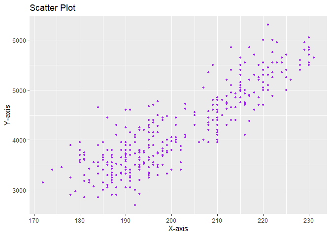

Assignment B-1: Making a function
================
Andras Szeitz

Load the packages below.

``` r
#loading libraries 
library(datateachr)
library(tidyverse)
```

    ## ── Attaching core tidyverse packages ──────────────────────── tidyverse 2.0.0 ──
    ## ✔ dplyr     1.1.3     ✔ readr     2.1.4
    ## ✔ forcats   1.0.0     ✔ stringr   1.5.0
    ## ✔ ggplot2   3.4.4     ✔ tibble    3.2.1
    ## ✔ lubridate 1.9.3     ✔ tidyr     1.3.0
    ## ✔ purrr     1.0.2     
    ## ── Conflicts ────────────────────────────────────────── tidyverse_conflicts() ──
    ## ✖ dplyr::filter() masks stats::filter()
    ## ✖ dplyr::lag()    masks stats::lag()
    ## ℹ Use the conflicted package (<http://conflicted.r-lib.org/>) to force all conflicts to become errors

``` r
library(ggplot2)
library(testthat)
```

    ## 
    ## Attaching package: 'testthat'
    ## 
    ## The following object is masked from 'package:dplyr':
    ## 
    ##     matches
    ## 
    ## The following object is masked from 'package:purrr':
    ## 
    ##     is_null
    ## 
    ## The following objects are masked from 'package:readr':
    ## 
    ##     edition_get, local_edition
    ## 
    ## The following object is masked from 'package:tidyr':
    ## 
    ##     matches

``` r
library(datateachr)
library(palmerpenguins)
```

\#Exercise 1: Make a Function

``` r
#I wrote a function using the cancer_sample dataset from mda deliverable 1 to generate a scatter plot.

scatter_plot <- function(x, y, x_label = "X-axis", y_label = "Y-axis", title = "Scatter Plot") {
  plot_data <- data.frame(x = x, y = y)
  
  # Suppressing warnings while creating the plot
  suppressWarnings({
    scatter_plot <- ggplot(plot_data, aes(x = x, y = y)) +
      geom_point(size = 1, color = "purple") +
      labs(x = x_label, y = y_label, title = title)
  })
  
  # Printing the scatter plot
  print(scatter_plot)
}

scatter_plot(x = cancer_sample$concavity_mean, y = cancer_sample$smoothness_mean)
```

<!-- -->

\#Exercise 2: Document your Function

``` r
# 1. Title

#  A function to make a scatter plot from the variables of the cancer_sample dataset

#  2. Function description

# Using the cancer_sample dataset, this function creates a generic scatter plot using ggplot2 that can be utilized with other numerical data.

# 3. Document each argument with the @param tag

# @param x The numerical independent data for the x-axis

# @param y The numerical dependent data for the y-axis

# @param x_label The label for the x-axis

# @param y_label The label for the y-axis

# @param title The title of the scatter plot

# @return It generates a scatter plot

# @examples scatter_plot(x = cancer_sample$concavity_mean, y = cancer_sample$smoothness_mean)

# I named the labels 'X-axis', 'Y-axis' to be generic for any numerical data without using a specific name. I named scatter plot to use a universal name of the plot for any application without any specific designation.
```

\#Exercise 3: Include examples

``` r
#Using the palmerpenguins dataset, I examined if there was any correlation between the flipper length (X-axis) and  body weight (Y-axis) of the penguins. The scatter plot shows that there seems to be a linear relationship between the data indicating that the longer the flippers the heavier the penguins are.

scatter_plot(x = penguins$flipper_length_mm, y = penguins$body_mass_g)
```

    ## Warning: Removed 2 rows containing missing values (`geom_point()`).

<!-- -->

``` r
#Using the cancer_sample dataset, I investigated if there was any relationship between the perimeter_mean (X-axis) and  texture_mean (Y-axis) of the tumor parameters. The scatter plot revealed that there was not an identifiable correlation between the two parameters. 

scatter_plot(x = cancer_sample$perimeter_mean, y = cancer_sample$texture_mean)
```

<!-- -->

``` r
#Using the 'vancouver_trees' dataset, I wanted to find out if there was any correlation between the date the trees were planted and the building blocks where they were planted. The scatter plot showed that in the early 1990's, trees were planted at lower building block numbers, while between 1998 and 2015 most trees were planted around the 8750 building block.

scatter_plot(x = vancouver_trees$date_planted, y = vancouver_trees$on_street_block)
```

    ## Warning: Removed 76548 rows containing missing values (`geom_point()`).

<!-- -->

\#Exercise 4: Test the Function

``` r
test_that("To see if the function creates a ggplot",{
  sp <- scatter_plot(x = cancer_sample$perimeter_mean, y = cancer_sample$texture_mean)
  expect_is(sp,"ggplot")
})
```

<!-- -->

    ## Test passed 🎉

``` r
test_that("To see if the function uses the right dataset", {
    scatter_plot(x = cancer_sample$perimeter_mean, y = cancer_sample$texture_mean)
   expect_true(TRUE, "Test passed.")
})
```

<!-- -->

    ## Test passed 🎊

``` r
test_that("To see if the function requires a dataset and variables, rather than a row of numbers", {
  # Checking if the arguments are data frames and character strings
  expect_true(is.data.frame(cancer_sample) && is.character("perimeter_mean") && is.character("texture_mean"), "Test passed.")
})
```

    ## Test passed 🎊

``` r
test_that("To see if the function can only use numerical dataset", {
  expect_error(easyplot(vancouver_trees$date_planted, vancouver_trees$on_street_block))
})
```

    ## Test passed 🌈
